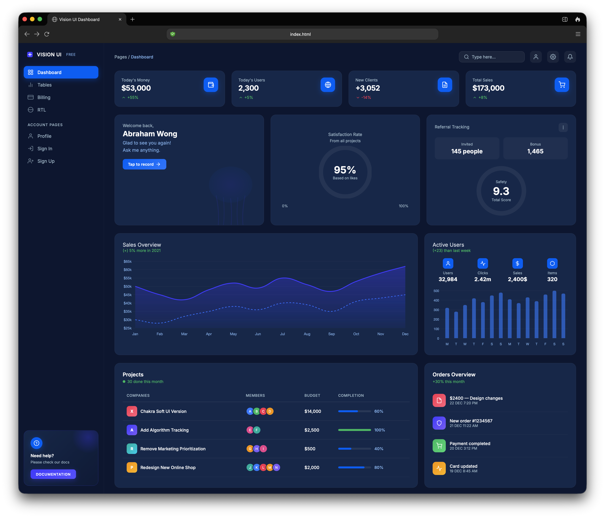

# Vision UI Dashboard

A sleek dark-themed dashboard UI built with vanilla HTML, CSS, and JavaScript.

## Preview

## Features

- **Single-file architecture** — all styles and scripts live in one `index.html`.
- **7 navigable tabs** — Dashboard, Tables, Billing, RTL, Profile, Sign In, Sign Up.
- **Interactive charts** — powered by Chart.js for sales overview and active users.
- **Dark blue theme** — consistent color palette with CSS custom properties.
- **Responsive sidebar** — fixed navigation with active state indicators.

## Usage

Open `index.html` in a browser. No build step or dependencies required.

## Notes

- The RTL tab renders content right-to-left while keeping all text in English.
- Font: [Inter](https://fonts.google.com/specimen/Inter) (loaded via Google Fonts CDN).
- Charting: [Chart.js](https://www.chartjs.org/) v4.4.0 (CDN).

> **Credit:** [GeekSloth](https://github.com/geeksloth)
